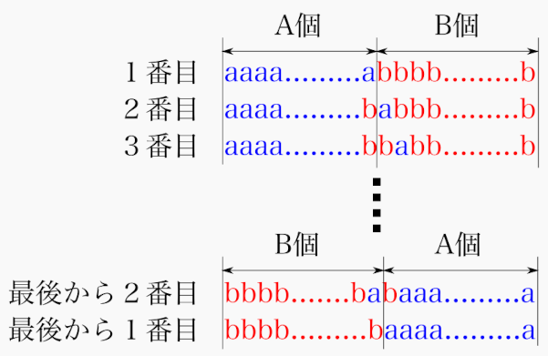
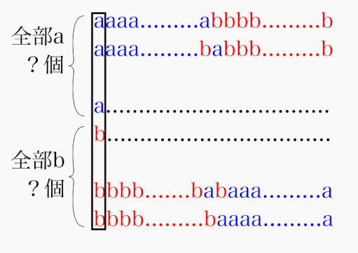
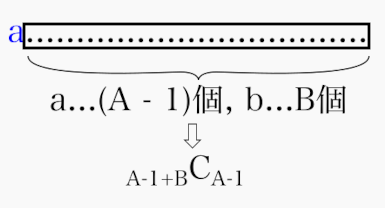

# ABC202 D - aab aba baa

[https://atcoder.jp/contests/abc202/tasks/abc202_d](https://atcoder.jp/contests/abc202/tasks/abc202_d)

実行時間制限: 2 sec / メモリ制限: 1024 MB

## 問題
　
\\(A\\)個の\\(a\\)と\\(B\\)個の\\(b\\)からなる長さ\\(A+B\\)
 の文字列のうち、辞書順で \\(K\\)番目のものを求めてください。

## 制約

- \\(1 \leq A, B \leq 30 \\)
- \\(A\\)個の\\(a\\)と\\(B\\)個の\\(b\\)からなる長さ\\(A+B\\)の文字列の総数を\\(S\\)個と置いた時、\\(1 \leq K \leq S\\)
- 入力は全て整数である。

## 解法
問題をイメージしてみると、辞書順に並べるということは以下のように並べることである。<br>

<div align="center"></div>

ここで先頭の文字に注目すると最初は<font color="blue">\\(a\\)</font>が続き、途中で<font color="Red">\\(b\\)</font>になってからは最後まで<font color="blue">\\(a\\)</font>に戻ることがないのがわかる。

<div align="center"></div>
ではこの、<b>１文字目がaの文字列</b>は何個続くのだろうか。<br>

ここで2文字目以降に注目する。２文字目以降の文字数は当然一つ減るので\\(A-1+B\\)個(内訳は\\(a\\)が\\(A-1\\)個、\\(b\\)が\\(B\\)個)である。これが色々並んでいるわけだが、並び順はわからずとも実はいくつ並んでいるかは<b>組み合わせの数(Combination)</b>で分かる。どういうことかというと紙を\\(A-1+B\\)枚並べて、そのうちの\\(A-1\\)枚に\\(a\\)を書く書き方は何通りあるか　を計算するのと同じなのである。\\(b\\)は自動的に\\(a\\)が書かれなかった場所に書かれるため<b>\\(a\\) を書く紙を選んだ後\\(b\\)を書く場所を考える必要はない。</b><br>この計算は<b>コンビネーション(Combination)</b>と呼ばれており

\\[
  {}_{n} {C} _{m} = \frac{(m)!}{(n)!(m-n)!}
\\]

と表記・計算される。これを今回の場合に当てはめると<br>

\\[
  {}_{A-1+B} {C} _{A-1} = \frac{(A-1+B)!}{(A-1)!(B)!}
\\]

となる。

<div align="center"></div>

ところで、この問題は\\(K\\)番目の文字の並べ方を探すものであった。\\({}_{A-1+B} {C} _{A-1}\\)は先頭1文字目が \\(a\\) のものを並べた総数であるため、（２文字目以降はわからないが）少なくとも
> \\({}_{A-1+B} {C} _{A-1} > K\\)であれば、最初の\\(1\\)文字目は<font color="Red">\\(b\\)</font>、そうでなければ<font color="blue">\\(a\\)</font>

ということが分かる。これで最初の1文字目が決定した。では2文字目以降はというと、実は同じように考えれば良くて

- \\(A-1\\)個の\\(a\\)と\\(B\\)個の\\(b\\)からなる長さ\\(A-1+B\\) の文字列のうち、辞書順で \\(K\\)番目のものを求めてください。<b>(1文字目が\\(a\\)の時)</b>
- \\(A\\)個の\\(a\\)と\\(B-1\\)個の\\(b\\)からなる長さ\\(A+B-1\\) の文字列のうち、辞書順で \\(K - {}_{A-1+B} {C} _{A-1}\\)番目のものを求めてください。<b>(1文字目が\\(b\\)の時)</b>


という、この問題そのものを解くのと同じことになり、これを繰り返せば再起的に問題が解けそうである。徐々に文字が \\(a\\) と確定することによって \\(K\\) が減っていき、最終的に \\(K = 0\\) となった瞬間に全ての文字が決まる、という考え方である。
<br>
ところで、この組み合わせの数 (Combination)は以下のような特徴的な関係がある。

> \\(  {}_n {C} _{m} = _{n-1} {C} _{m-1} + _{n-1} {C} _m\\)

また、\\( {}_n {C} _1 = n\\) であるため、この二つを使えば動的計画法で高速に\\({}_n {C}_m\\)が計算可能である。
以下は\\(1-MMAX\\)(この場合100)の間の\\(n\\)において\\({}_n {C} _{m}\\)を計算するコードである。
<br>一度計算してしまえばあとは
\\({}_n {C}_m \\) は \\(dp[n][m]\\)を呼び出すだけで良い。

```py
dp = list()
MMAX = 100 # Maximum number of parameter
for n in range(MMAX):
    tmp = [1] * (MMAX)
    dp.append(tmp)

#combination of nC1 = n
for n in range(1, MMAX):
    d[n][1] = n

#Filling numbers with dp
for n in range(1,MMAX):
    for m in range(1,MMAX):
        if m < n:
            dp[n][m] = dp[n-1][m-1] + dp[n-1][m]
        elif n == m:
            dp[n][m] = 1
```

今回の問題の場合、\\(1 \leq A + B \leq 60\\)であるため、上記のコードで全パターン計算してから上に書いた左端の文字から決定していくプロセスを進めて行っても十分間に合う。最終的な解法はこのようになる。

```py
A, B, K = map(int,input().split())

#DP part (culclate all combinations, nCm => dp[n][m] 
dp = list()
MMAX = 61
for n in range(MMAX):
    tmp = [1] * (MMAX)
    dp.append(tmp)

#combination of nC1 = n
for n in range(1, MMAX):
    d[n][1] = n

#Filling numbers with dp
for n in range(1,MMAX):
    for m in range(1,MMAX):
        if m < n:
            dp[n][m] = dp[n-1][m-1] + dp[n-1][m]
        elif n == m:
            dp[n][m] = 1

#Problem solving part
ret = ''
#remaining number of character'a' and 'b'
a,b = A, B
while True:
    # The first character is b if all the 
    # combinations of a,b, letters from 2nd to last is 
    # larger than K 
    if K > dp[a - 1 + b][b]:
        ret = ret + 'b'
        K -= dp[a - 1 + b][b]
        b -= 1
        if K == 0:
            break
    else:
        ret = ret + 'a'
        a -= 1
    if a == 0 or b == 0:
        if a == 0:
            ret += 'b' * b
        else:
            ret += 'a' * a
        break        

print(ret)
```
