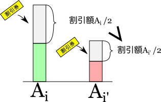
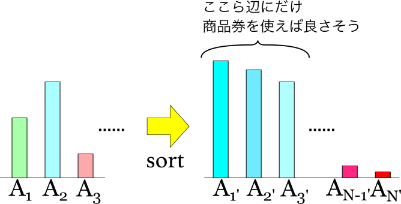
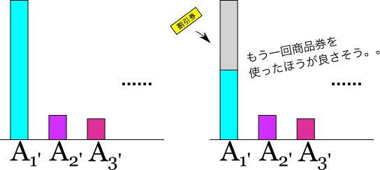

#  ABC141 D - Powerful Discount Tickets

[https://atcoder.jp/contests/abc141/tasks/abc141_d](https://atcoder.jp/contests/abc141/tasks/abc141_d)

実行時間制限: 2 sec / メモリ制限: 1024 MB

## 問題文

高橋くんは\\(N\\)個の品物を\\(1\\)個ずつ順番に買う予定です。

\\(i\\)番目に買う品物の値段は \\(A_i\\)円です。高橋くんは \\(M\\) の割引券を持っています。

品物を買う際に割引券を好きな枚数使うことができます。
\\(X\\)円の品物を買う際に\\(Y\\)枚の割引券を使った場合、その品物を\\(\frac{X}{2^Y}\\)
円(小数点以下切り捨て)で買うことができます。

最小で何円あれば全ての品物を買うことができるでしょうか。

## 制約

 - 入力は全て整数である
 - \\(1\leq N, M \leq  10 ^ 5 \\)
 - \\(1\leq A_i \leq  10 ^ 9 \\)

# 解法

割引券を\\(1\\)枚使った場合をまず考える。この時、以下のように高額な品物に割引券を使った方が支払うお金を抑えられることがわかる。

<div align="center"></div>

であれば、なるべく高価な品物に割引券を使えば割引額が大きくなり（=支払う金額が減り）、最終的な支払額を抑えられそうである。となると、商品を高額な順に並べて考えると良さそうである。
<div align="center"></div>
では品物の高い順に一枚ずつ商品券を使えばいいかというと、<font color="red"><b>そうではない場合もある。</b></font>以下のような極端なケースがそれに当たる。すなわち、もっとも高額な商品に割引券を使ってもまだその商品がもっとも高額だった時である。
<div align="center"></div>
では、もっとも高額な商品がその次に高額な商品よりもいくら高い時に何回商品券を使うか、場合分けしていけば良いのか。これは色々なケースがあって骨が折れそうである。しかし、以下のように考えればその商品に何枚の商品券を使うかは<b>そもそも考えなくて良い</b>ことがわかる。

 1. その時にもっとも高額な商品に商品券を使い、価格を半分にする。
 2. その商品の価格を半分にした後に、再び全ての商品の中で一番高いものを探す。
 3. 1、2を商品券がなくなるまで（すなわち\\(M\\)回）繰り返す。
 4. 最後に残った（割引済）商品の価格の和を求める。

次に実際の実装について。上記を実現するに当たって、商品の価格を常にソートされた配列で持つ場合、以下の2つの操作を毎回行う必要がある。
 
 - 最も高い商品を見つける
 - その商品の値の変更（もっとも高い商品を半額にすること）

商品の値を変更する際、ソートが崩れないようにするには、少なくとも\\(O(MN)\\)の計算量が必要である。
これは制限時間に間に合わない。

そこで<font color="red"><b>プライオリティキュー</b></font>を使う。プライオリティキューでは、要素の追加、取り出しの計算量が\\(O(\log N)\\)であるため、これを用いた場合、全体の計算量は\\(O(M \log N)\\)となって間に合う。

プライオリティキューに、最大値を見つけて取り出す関数はない（heapq.nlargestの計算量は\\(O(N)\\)以上\\(O(N \log N)\\)以下であり計算量が大きい上にプライオリティキューからの取り出しはできない）ので、今回のように最大値を取り出したい場合は、<b>要素を全て\\(-1\\)倍したプライオリティキューを用いることで、最大値（の\\(-1\\)倍）の値を取り出す</b>ことが可能である。
この手法で、本問題を解くことができます。

## 実装

```py
import heapq

N, M = map(int,input().split())
A = [*map(int,input().split())]

# multiply -1 to all the elements (全てのAの要素に-1をかける)
A = [-a for a in A]

# convert list to priority queue (Aをプライオリティキュー化)
heapq.heapify(A)

# pop the most expensive(this case, the minimum number), 
# divide by 2 (and add 1 if the original number is negative even)
# then add to the priority queue.
# repeat this M times.
# もっとも高価な商品を取り出し（ただし負数にしているので最小値）２で割って割引した値段にし、元のプライオリティキューに加え直す
# これをM回繰り返す
for _ in range(M):
    price = -heappop(A)
    heappush(A, -(price//2))

# culculate the sum of the last left priority queue and multiply -1
# 最後に残ったプライオリティキューの合計値を求めて、-1をかけて元に戻す
print(-sum(A))
```